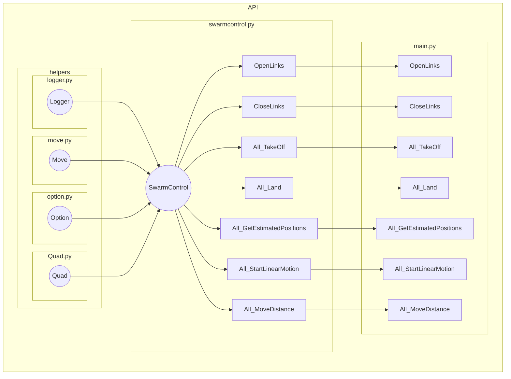
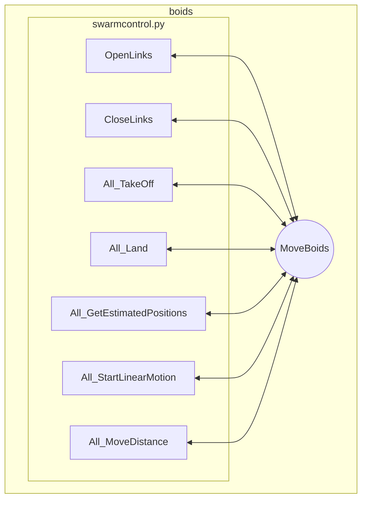

# DronelabV2
The reboot of the DVIC repo Dronelab using Crazyfly drones.

Here we use the cflib to control the drones. A framework with a higer learning rate to quickly develop. 

Our Solution works with an asynchronous API to controll our drones. 

We added here an example using the famous boids flock control algorithm, anther repo uses this framework using unity machine learning agents

# Get started
## Requirements
~~~
python3.10 here using 3.10.12
~~~
install virtualenv if you dont have it:

~~~
python3.10 -m pip install virtualenv 

~~~

clone the repository
~~~ 
git clone git@github.com:NLeboucher/DronelabV2.git
~~~
activate the virtual env from the root of the project
~~~
cd DRONELABV2
python3.10 -m virtualenv venv
sudo apt install python3.10-venv
source venv/bin/activate
~~~
install the python dependencies
~~~
pip install cflib pygame fastapi uvicorn mediapipe opencv-python pyrealsense tqdm jinja2
~~~

Now you have all the depedencies
## Use the framework
use the API/SwarmController with High Level methods to controll drones in a swarm

## Run the API
./runserverController

# Credits
boids_py from [Nathan Plamondon](https://github.com/meznak/boids_py), an implementation of Craig Reynolds' [Boids](https://www.red3d.com/cwr/boids/) in python using pygame.
